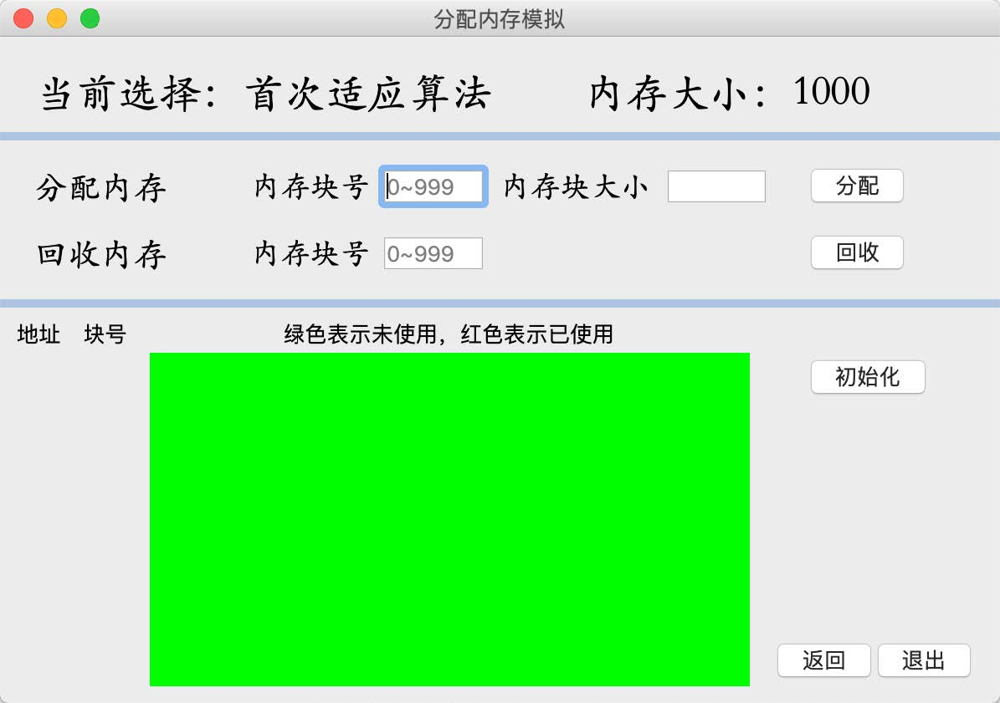
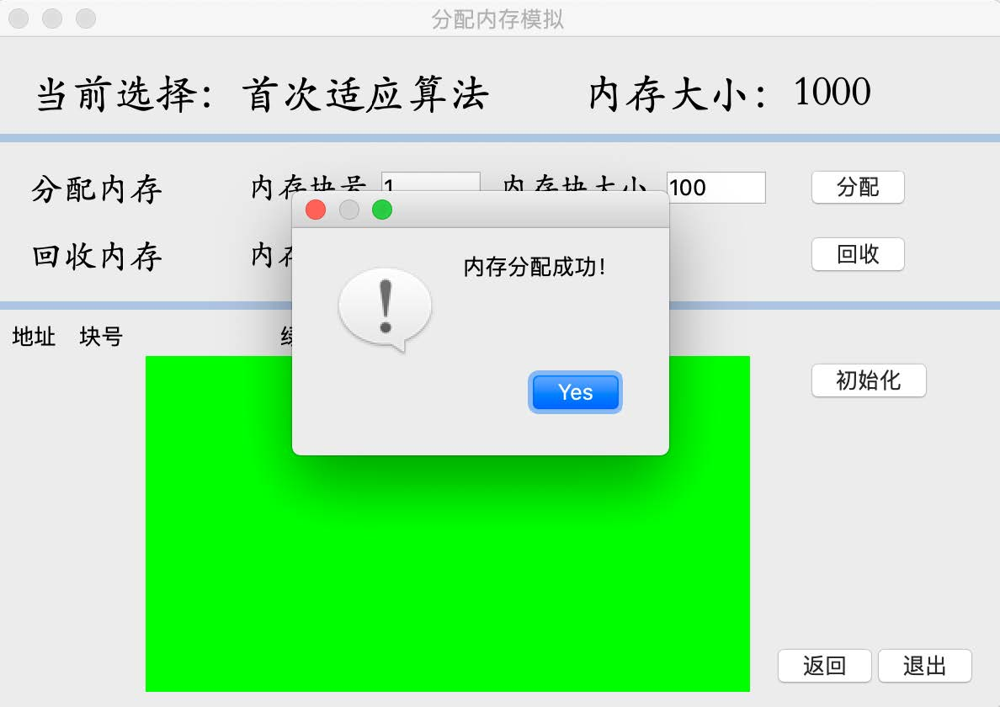
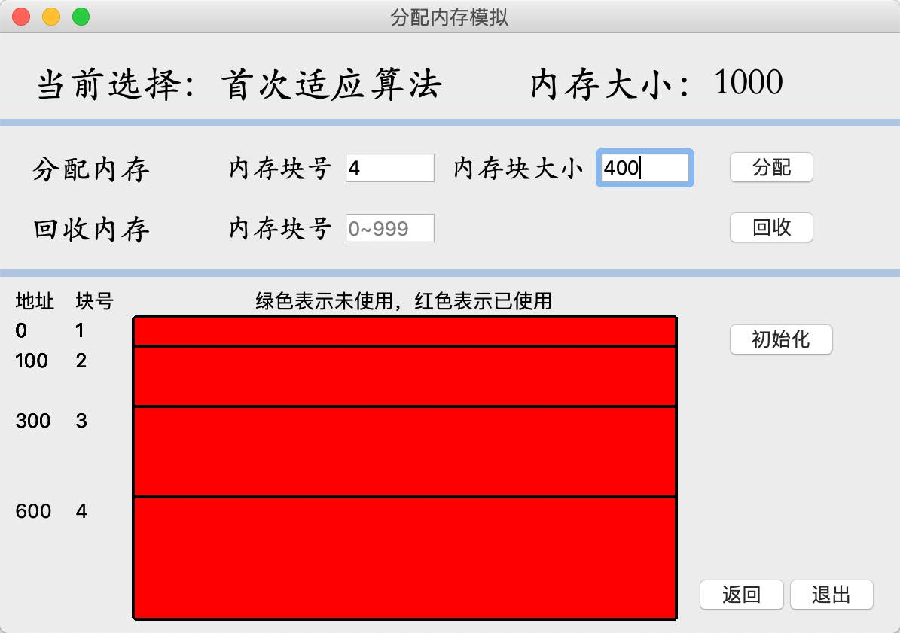
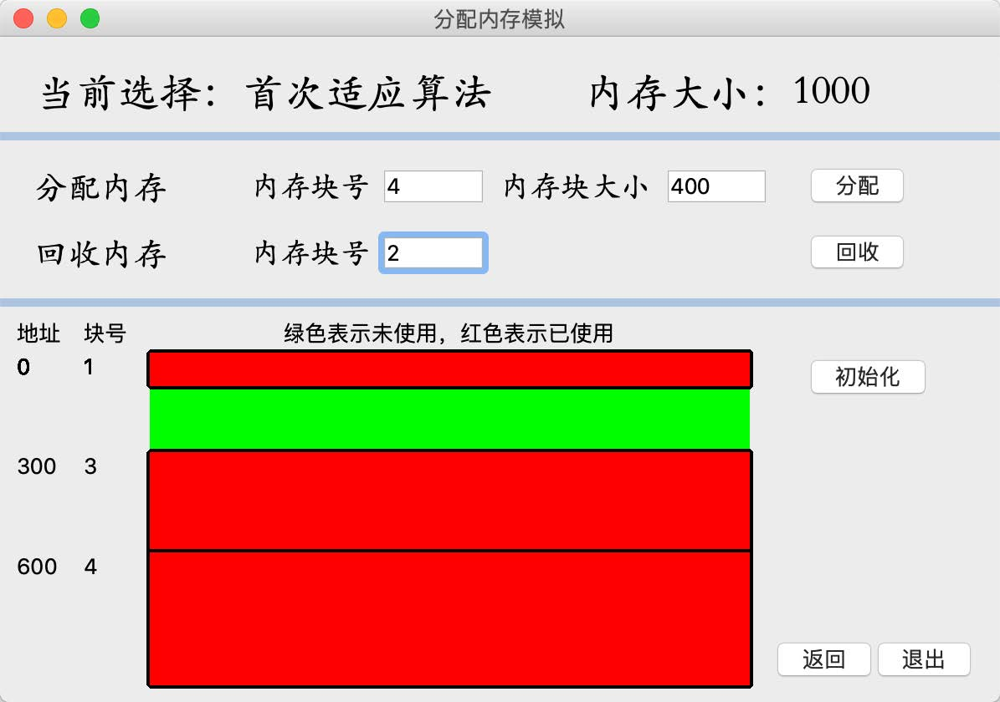
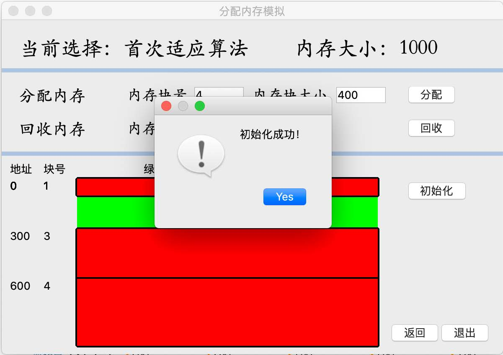
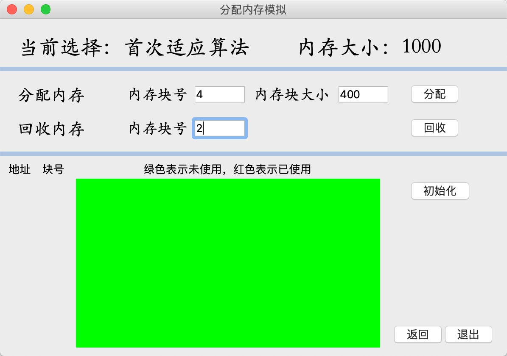
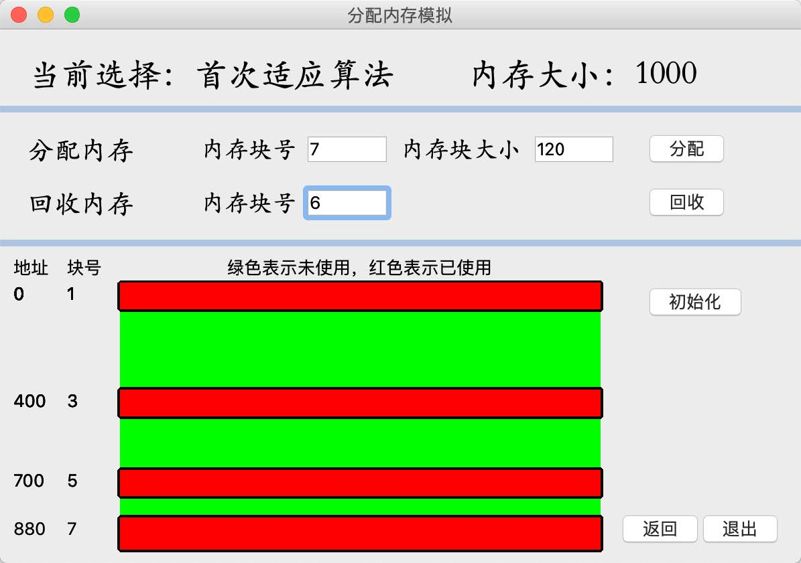
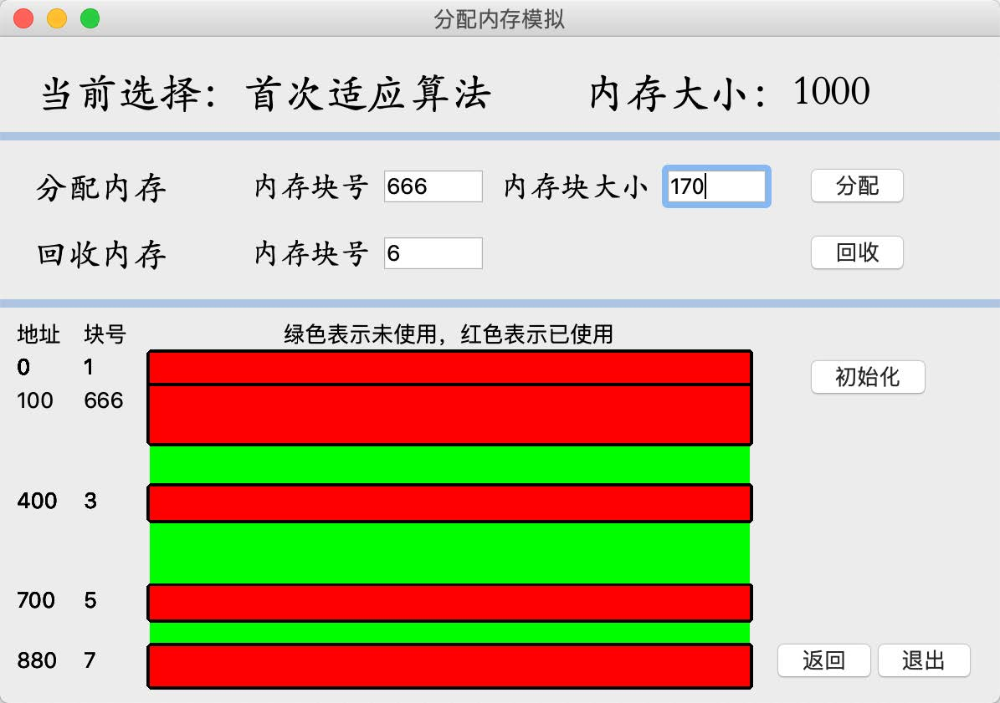
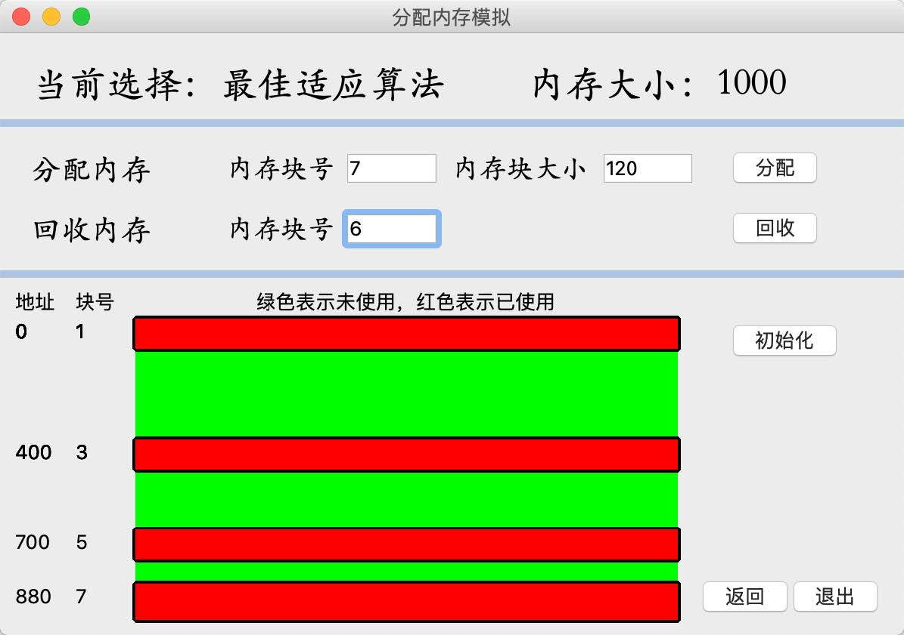
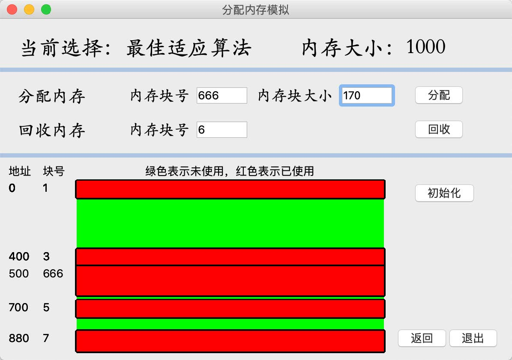

# Memory-Management

## 1 项目背景

该项目是同济大学软件学院2020年操作系统课中的作业之一

动态分区分配方式：分配算法加深动态分区存储管理方式及其实现过程的理解。

请求分页分配方式：页面、页表、地址转换页面置换过程；加深对请求调页系统的原理和实现过程的理解

该项目使用`Qt`开发


## 2 使用说明

### 2.1 ⾃定义内存⼤⼩与选择分配算法

进⼊主界⾯后，⾃定义内存⼤⼩（范围0~9999，单位KB，下同），点击确认，会有提示⾃定义内存⼤⼩分配成功


然后就可以选择要使⽤的算法，如果没有分配内存⼤⼩，⽆法选择算法：


### 2.2 分配内存块

进⼊算法⻚⾯，指定内存块号和块⼤⼩进⾏分配，指定内存块号进⾏回收





绿⾊表示内存未使⽤，红⾊表示内存已使⽤。左边有内存块的起始地址和块号，便于查看与回收



同样分配时不指定块号和⼤⼩⽆法分配，也不能重复对⼀个块号进⾏分配，会有相应的对话框提

示

|  |  |  |
| ---------------------------- | ---------------------------- | ---------------------------- |

### 2.3 内存回收

输⼊回收块号，点击回收按钮进⾏回收



### 2.4 初始化

对内存进⾏初始化，⼀键回收所有内存块





## 3 设计与实现

### 3.1 主窗口类widget

| 成员函数                          | 功能                 |
| --------------------------------- | -------------------- |
| Widget(QWidget *parent = nullptr) | 构造函数             |
| ~Widget()                         | 析构函数             |
| void pushData(int data)           | 信号：⾃定义内存⼤⼩ |
| void chooseAlgo(int algoChoose)   | 信号：记录算法选择   |

| 成员变量                     | 实现             |
| ---------------------------- | ---------------- |
| int algoChoose = -1          | 算法选择变量     |
| int memory = 0               | ⾃定的内存⼤⼩   |
| bool distribute[1] = {false} | 是否进⾏内存分配 |

```c++
class Widget : public QWidget {
	Q_OBJECT
	public:
		Widget(QWidget *parent = nullptr); //构造函数
		~Widget(); //析构函数
		AdaptAlgo * algorithmScene = NULL; //算法实现界⾯
		int algoChoose = -1; //算法选择变量
		//-1未选择 1⾸先适配算法 2最佳适配算法
		int memory = 0; //⾃定的内存⼤⼩
		bool distribute[1] = {false}; //是否进⾏内存分配
	signals:
		void pushData(int data); //信号：⾃定义内存⼤⼩
		void chooseAlgo(int algoChoose); //信号：算法选择
};
```

### 3.2 算法窗⼝类 AdaptAlgo

| 成员函数             | 功能                                 | 参数                 |
| -------------------- | ------------------------------------ | -------------------- |
| explicit AdaptAlgo() | 构造函数                             | QWidget *parent      |
| void paintEvent()    | 重写paintEvent()，实现图形化内存分配 | QPaintEvent *event   |
| int firstAdapt()     | 实现⾸先适配算法                     | int taskNum,int size |
| int bestAdapt()      | 实现最佳适配算法                     | int taskNum,int size |
| void initPartition() | 初始化内存链表                       |                      |
| int recycleMem()     | 实现回收内存                         | int taskNum          |
| void showMem()       | 输出内存情况                         |                      |
| void backMainScene() | 信号：返回主界⾯                     |                      |
| void getData()       | 槽函数：从主界⾯获取内存⼤⼩         | int get              |
| void getAlgo()       | 槽函数：从主界⾯获取算法选择         | int algo             |

| 成员变量             | 功能                       |
| -------------------- | -------------------------- |
| QLineEdit * memsize  | 标签指针，动态展示内存⼤⼩ |
| int memory           | 记录内存⼤⼩               |
| int chooseAlgo       | 记录算法选择               |
| bool initSuccess     | 判断是否初始化             |
| bool huizhi          | 判断是否绘制内存           |
| struct partitionNode | 内存分配结构体             |

```c++
class AdaptAlgo : public QWidget {
Q_OBJECT
	public:
		explicit AdaptAlgo(QWidget *parent = nullptr);
		QLineEdit * memsize = new QLineEdit;
		int memory = 0;
		int chooseAlgo = -1;
		bool initSuccess = false;//是否初始化
		bool huizhi = false;//是否需要更新图像显示
		struct partitionNode {
			int address; //起始地址
			int size; //分区⼤⼩
			int taskNum; //作业号
			QString state; //分区状态
			partitionNode* pre; //分区前指针
			partitionNode* next; //分区后指针
		}partitionHead;
		void paintEvent(QPaintEvent *event);
		int bestAdapt(int taskNum,int size); //最佳适应算法
		int firstAdapt(int taskNum,int size); //⾸次适应算法
		void initPartition(); //初始化空闲分区
		int recycleMem(int taskNum); //回收内存
		void showMem(); //展示内存状态
	signals:
		//⾃定义信号 点击返回信号
		void backMainScene();
		public slots:
		void getData(int get);
		void getAlgo(int algo);
};
```

### 3.3 首次适应算法(最先适配算法)

⾸次适应算法从空闲分区表的第⼀个表⽬起查找该表，把最先能够满⾜要求的空闲区分配给作业，这种⽅法⽬的在于减少查找时间。

从分区表（链表）的头部开始查找，找到第⼀个满⾜条件的分区，即状态为free且块⼤⼩⼤于等于待分配的内存⼤⼩。如果内存⼤⼩正好，则整块进⾏分配，⽆需再次切分；否则切分为两块，将下⼀块链接在已分配内存块后。

如果没有找到合适的内存块，则分配失败。

```c++
int AdaptAlgo::firstAdapt(int taskNum,int size) {
		partitionNode* p = partitionHead.next;
		while(p != NULL) {
			if(p->taskNum == taskNum) {
				QMessageBox::critical(NULL,"提示","内存块号重复请重新输⼊！",QMessageBox::Yes);
				return 0;
			}
    //从头找到第⼀个满⾜分配条件的分区
		if(p->state == "free" && p->size >= size) {
      if(p->size - size <= 10) {
				p->state = "busy";
				p->taskNum = taskNum;
		}else {
				partitionNode* s = new partitionNode;
        s->address = p->address + size;
				s->size = p->size - size;
				s->state = "free";
				s->taskNum = -1;
				s->pre = p;
				s->next = p->next;
				if(p->next != NULL) {
					p->next->pre = s;
				}
				p->next = s;
				p->state = "busy";
				p->taskNum = taskNum;
				p->size = size;
		}
		QMessageBox::information(NULL, "内存分配", "内存分配成功！",
		QMessageBox::Yes, QMessageBox::Yes);
		return 1;
		}
		p = p->next;
}
	QMessageBox::critical(NULL,"提示","没有合适的内存分区，分配失败！",QMessageBox::Yes);
	return 0;
}
```


### 3.4  最佳适应算法

最佳适应算法是指从全部空闲区中找出能满⾜作业要求且⼤⼩最⼩的空闲分区的⼀种计算⽅法，这种⽅法能使碎⽚尽量⼩。

⾸先创建两个变量，分别记录截⾄⽬前为⽌最符合分配要求（内存块⼤⼩与待分配内存⼤⼩最接近）的内存块的指针和⼤⼩，然后从头遍历链表，更新这两个变量直⾄链表结尾。

如果找到了这样的⼀个内存块（指针不指向NULL），怼他进⾏分配，分配⽅式同上，如果内存块⼤⼩等于待分配的内存的⼤⼩，则进⾏全块分配，否则将内存块切分。如果没有找到则分配失败。

```c++

else
{
QMessageBox::critical(NULL,"提示","没有合适的内存分区，分配失
败！",QMessageBox::Yes);
return 0;
}int AdaptAlgo::bestAdapt(int taskNum,int size) {
	partitionNode * bestByNow = NULL; //截⾄⽬前为⽌最好的选择（区间）
	int bestSizeByNow = memory+1; //截⾄⽬前为⽌最好的区间的⼤⼩
	partitionNode *p = partitionHead.next;
	while(p != NULL) {
		if(p->taskNum == taskNum) {
			QMessageBox::critical(NULL,"提示","内存块号重复请重新输⼊！",QMessageBox::Yes);
			return 0;
		}
    if(p->state == "free" && p->size >=size && p->size < bestSizeByNow) {
			bestByNow = p;
			bestSizeByNow = p->size;
    }
		p = p -> next;
	}
  if(bestByNow != NULL){
    if(bestByNow->size == size) {
			bestByNow->state = "busy";
			bestByNow->taskNum =taskNum;
		} else {
			partitionNode* s = new partitionNode;
			s->address = bestByNow->address + size;
			s->size = bestByNow->size - size;
			s->state = "free";
    	s->taskNum = -1;
      s->pre = bestByNow;
			s->next = bestByNow->next;
			if(bestByNow->next != NULL) {
				bestByNow->next->pre = s;
			}
			bestByNow->next = s;
			bestByNow->state = "busy";
			bestByNow->taskNum = taskNum;
			bestByNow->size = size;
		}
		QMessageBox::information(NULL, "内存分配", "内存分配成功！",
		QMessageBox::Yes, QMessageBox::Yes);
		return 1;
    else {
			QMessageBox::critical(NULL,"提示","没有合适的内存分区，分配失败！",QMessageBox::Yes);
			return 0;
		}
}
```

### 3.5 其他函数

#### 3.5.1 回收内存函数

根据内存块号，找到相应的内存块，在回收时分为四种情况：

- 需要合并前后两个内存块
- 只需要合并前⾯的内存块
- 只需要合并后⾯的内存块
- 不需要合并其他内存块

根据四种情况对链表进⾏响应的操作即可。

#### 3.5.2 paintEvent函数

在QT中，paintEvent函数⽤于绘制图形。为了⽤图形展示内存分配情况，需要重写paintEvent函数。主要是对分配回收的实时更新，通过增删标签实现地址与块号的展示，通过增删填充颜⾊的⻓⽅形来展示内存块的状态。当需要更新内存块状态时，由showMem()函数发出信号，更改 huizhi = 1，因为paintEvent()通过update()不断刷新，所以可以同时捕获到huizhi的变化，从⽽进⾏更改。


## 4 功能验证

主要通过算法的对⽐进⾏验证。

内存⼤⼩：1000kb

请求序列：

| 分配/回收 | 内存块号 | 内存块⼤⼩ |
| --------- | -------- | ---------- |
| 分配      | 1        | 100        |
| 分配      | 2        | 300        |
| 分配      | 3        | 100        |
| 分配      | 4        | 200        |
| 分配      | 5        | 100        |

### 4.1 ⾸次适应算法

在执⾏最后⼀步分配前，内存状态如图所示



最后⼀步分配后，⼤⼩为170kb的内存块分配到了块号为1和3的内存块之间，此内存块为第⼀块符合条件的内存块，分配符合⾸次适应算法



### 4.2 最佳适应算法

在执⾏最后⼀步分配前，内存状态如图所示



最后⼀步分配后，⼤⼩为170kb的内存块分配到了块号为3和5的内存块之间，此区间⼤⼩与170kb最为接近，分配符合最佳适应算法

